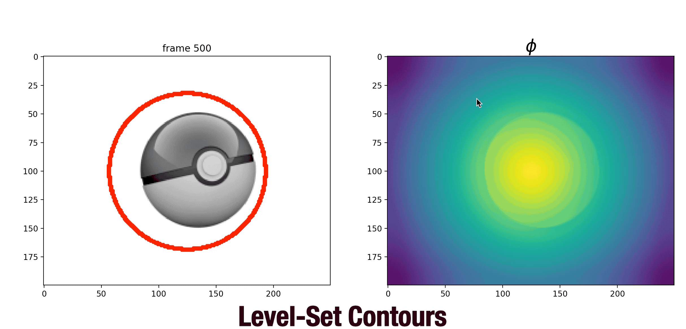
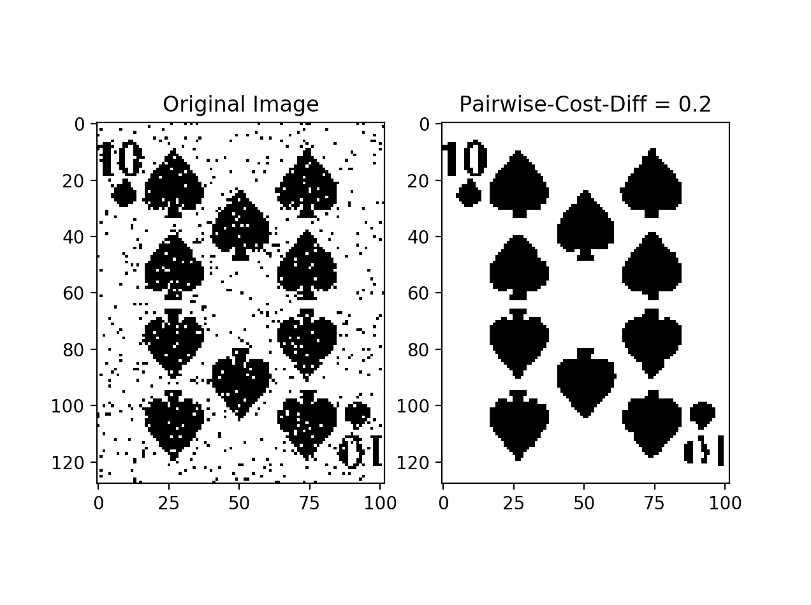
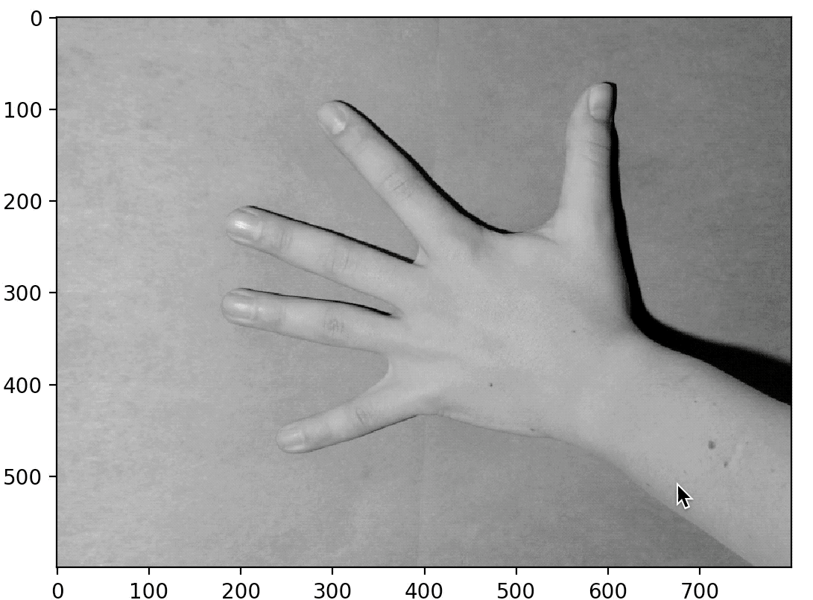

# vision-ary
This repository consists of my work on various topics in Computer Vision.

## 1. Level Set Based Contour Fitting
This project concerns with object segmentation the image using level-sets with an geodesic active contour. Firstly, a contour is initialized by a circle around the object and the a signed distance transform is evaluated to initialize the level-set function.Then on, the geodesic contour is optimized by gradient descent. The gradual change in the level-set function is visualized to show how the contour converges to the boundary of the object.
The final result looks like this

## 2. Snakes Based Contour Fitting (Dynamic Programming)
This project concerns with object segmentation of the object in the image using snakes ( Active Contours).Firstly, a snake is initiaslized  by a circle around the object and the energy function consisting of the elasticity and smoothness term is optimized using dynamic programming. The elastic term  is a pairwise cost, penalizing deviation from the average distance between pairs of nodes. Finally converges of the snake to the boundary of the object is visualized.
The final result looks like this

## 3. Markov Random Fields for Image Denoising (Graph-Cuts)
This project concerns with image denoising using Markov Random Fields which uses the Markov property that a nodes state only depends on its neighboring nodes. Markov Random Fields uses the prior that neighhboring pixels are smooth. If the neighboring pixels are different, they are penalized. The image is converted in a graph data structure using pixels as nodes. Each pixel (node) are connected to the “source node” and the “sink node” with directed edges as well as the directed edges between its left, top, right and bottom neighboring pixel. The uanry term is the likelihood term derived using Bernoulli distribuiton. While the pairwise terms are derived according the smoothness prior discussed above. If the pixels are same, the pairwise term is small, otherwise its large. Min-cut algorithm is then applied on this graph structure to ensure we get a MAP estimate. The idea is extended to more than one labels using alpha expansion, which approximates the solution for non-conve Potts model.
The final result looks like this

## 4. Iterative Closest Point Algorithm for Template Shape Model
In this approach, we iteratively find the closest point on the edge. At each iteration, once we have found the
closest edge points, we apply an affine transformation on the original landmark points, to get new landmmark
points that are closer to the edge points. We claim to have converged when the psi stops changing.

1. Find edges of the hand image using Canny
2. Pre-compute the distance transform of the image
step 3 : For each point w find the closest point in the edges.(Correspondence)
 a. w = Point on the shape model. (trasnformed)
 b. E = Point in the edge list.
 c. D : Distance transform at point (w)
 d. G = Find the gradient of the distance transform.
 e. x = (w - (D/Magnitude(G))*(Gx*Gy))
step 4 : Find an affine transformation using closed form solution.

